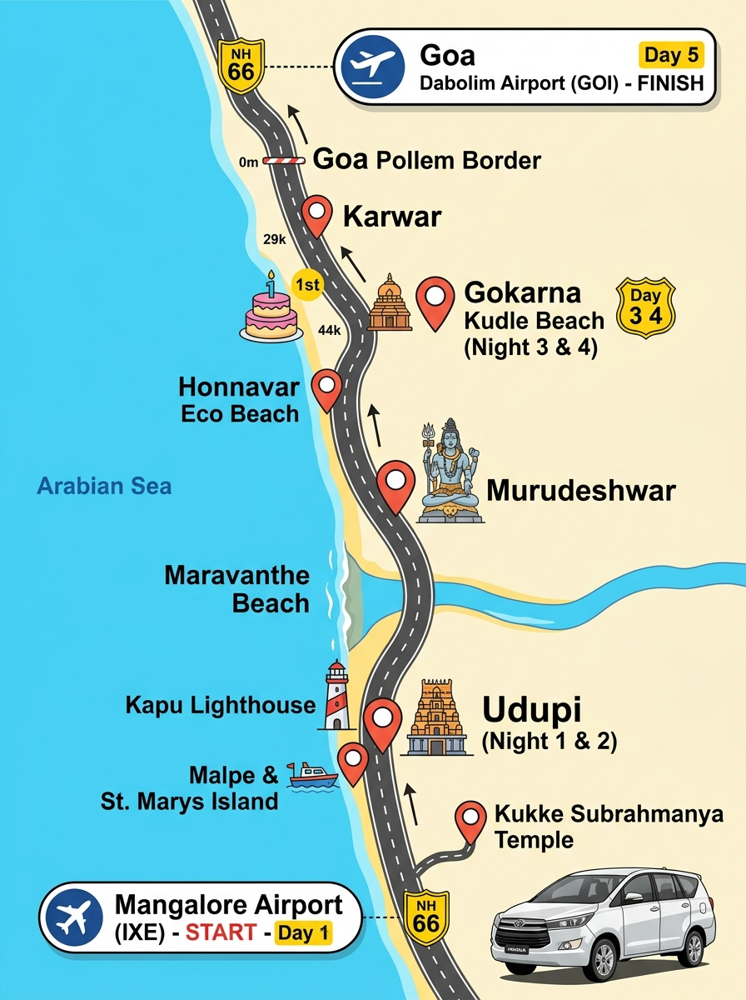

# Driver Duty Slip & Trip Summary: Coastal Karnataka Tour



## Booking & Vehicle Overview

- **Service Type:** Outstation Multi-Day Tour with Night Halts & One-Way Interstate Drop
- **Vehicle Type:** **Toyota Innova Crysta (AC)** — 7-Seater (Captain Seats preferred) or 8-Seater
- **Trip Dates:** **Thursday, 12 November 2026 to Monday, 16 November 2026** (5 Days / 4 Nights)
- **Passengers:** 4 Persons (2 Adults, 1 Child aged 6 yrs, 1 Infant aged 1 yr)
- **Luggage:** 3 Medium Trolley Bags, 1 Compact Foldable Baby Stroller, 2 Small Hand Bags
- **Starting Point (Pickup):** **Mangalore International Airport (IXE)** — Thursday, 12 Nov 2026 @ **08:45 AM**
  *(Flight: IndiGo 6E 7581 from Hyderabad landing at 08:35 AM)*
- **Ending Point (Drop):** **Goa Dabolim Airport (GOI), Terminal 1 Departures** — Monday, 16 Nov 2026 @ **16:30–17:00 PM**
  *(Flight: IndiGo 6E 6116 to Hyderabad departing at 19:40 PM)*
- **Total Estimated Distance:** **~640 – 660 km** over 5 Days
- **Driver Night Halts:**
  - Night 1 (Thu 12 Nov): **Udupi Town**
  - Night 2 (Fri 13 Nov): **Udupi Town**
  - Night 3 (Sat 14 Nov): **Gokarna**
  - Night 4 (Sun 15 Nov): **Gokarna**

---

## 📱 WhatsApp Quick-Share Format (Send Directly to Driver / Cab Operator)

*Copy and paste the box below into WhatsApp:*

```text
========================================
🚗 INNOVA CRYSTA TRIP SHEET (12-16 NOV 2026)
========================================
Family: 2 Adults + 1 Child (6 yr) + 1 Baby (1 yr)
Luggage: 3 Trolleys + 1 Baby Stroller
Vehicle: Innova Crysta AC (Clean, Seatbelt working in middle row for baby car seat)

📍 PICKUP:
Date & Time: Thursday, 12 Nov 2026 at 08:45 AM
Location: Mangalore Airport (IXE) Arrivals Gate
Flight: IndiGo 6E 7581 from Hyderabad (lands 08:35 AM)

📍 FINAL DROP:
Date & Time: Monday, 16 Nov 2026 by 04:30 PM - 05:00 PM
Location: South Goa Dabolim Airport (GOI) Terminal 1
Flight: IndiGo 6E 6116 to Hyderabad (departs 07:40 PM)

----------------------------------------
🗓️ DAY-WISE ROUTE & HALTS:
----------------------------------------
DAY 1 (Thu 12 Nov) - ~250 km:
• 08:45 AM: Pickup Mangalore Airport (IXE)
• 09:15 AM - 10:15 AM: Breakfast halt at Bantwal (Hotel Aditya, NH73)
• 10:15 AM - 12:15 PM: Bantwal -> Kukke Subrahmanya (~80 km via Kadaba)
• 12:15 PM - 02:00 PM: Kukke Temple Darshan & Lunch
• 02:00 PM - 05:15 PM: Kukke -> Udupi Town (~145 km via NH73/NH66)
• 05:15 PM: Check-in Hotel at Udupi City Center (near Sri Krishna Temple)
• Evening: Short local drive / Sri Krishna Temple & Dinner
• NIGHT HALT: UDUPI TOWN

DAY 2 (Fri 13 Nov) - ~50 km (Local Udupi):
• 08:30 AM: Hotel -> Malpe Tourist Boat Jetty (~7 km) for St. Mary's Island
• 09:00 AM - 11:30 AM: Family visits island (Driver rest at Malpe parking)
• 11:45 AM: Pickup Malpe Jetty -> Lunch in town -> Hotel drop (1:00 PM - 4:00 PM Family Nap / Driver Rest)
• 04:00 PM: Short drop to Sri Krishna Matha / Car Street
• 06:00 PM: Drive Udupi -> Kapu Beach & Lighthouse (~16 km) for sunset
• 07:30 PM: Kapu -> Dinner & Hotel drop in Udupi
• NIGHT HALT: UDUPI TOWN

DAY 3 (Sat 14 Nov) - ~190 km (Coastal NH66 North):
• 08:45 AM: Checkout Udupi Hotel with luggage loaded
• 09:45 AM - 10:30 AM: Maravanthe Beach photo stop (NH66)
• 11:15 AM - 01:30 PM: Murudeshwar Temple & Shiva Statue darshan + Lunch (Naveen Beach Restaurant)
• 02:15 PM - 03:30 PM: Kasarkod Eco Beach, Honnavar (Blue Flag beach halt)
• 03:30 PM - 05:30 PM: Honnavar -> Kumta -> Gokarna
• 05:45 PM: Drop at Kudle Beach View Resort & Spa, Gokarna
• NIGHT HALT: GOKARNA

DAY 4 (Sun 15 Nov) - ~15 km (Baby 1st Birthday - Mostly Free Day for Driver):
• Morning & Afternoon: ZERO highway driving. Family celebrates 1st birthday at resort. Driver has free time / rest all day!
• 05:00 PM: Evening pickup from resort -> 10-min drive to Sri Mahabaleshwar Temple, Gokarna town & Kotitirtha
• 06:30 PM: Drop back to Kudle Beach View Resort
• NIGHT HALT: GOKARNA

DAY 5 (Mon 16 Nov) - ~140 km (Flat Coastal NH66 via Karwar to Goa):
• 11:00 AM: Checkout Gokarna Resort with luggage loaded
• Route: Strictly Coastal NH66 (NO GHATS / NO ARBAIL GHAT)
• 12:15 PM - 01:45 PM: Lunch halt at Karwar (Hotel Amrut, NH66)
• 02:00 PM: Cross Karnataka-Goa border at Pollem Checkpost (5-min interstate permit entry)
• 02:15 PM - 04:30 PM: Pollem -> Canacona -> Margao bypass -> Dabolim Airport
• 04:30 PM - 05:00 PM: Final Drop at GOA DABOLIM AIRPORT (GOI) Terminal 1 Departures. Trip Ends.

----------------------------------------
⚠️ IMPORTANT RULES FOR DRIVER:
----------------------------------------
1. BABY ON BOARD: 1-yr-old infant & 6-yr-old child. Drive very smooth, steady speed (60-80 km/h), NO sudden braking, NO rash overtaking.
2. CAR SEAT: Middle row seatbelt must be working properly to secure baby car seat.
3. AC: 100% full-time AC on at all times.
4. DAY 5 ROUTE: Follow ONLY coastal highway NH66 (Karwar -> Pollem -> Margao -> Dabolim). DO NOT take any interior ghat roads (No Arbail / No Yellapur).
5. GOA ENTRY TAX: Yellow-board commercial car must have valid AITP/permit papers. Goa state commercial entry tax at Pollem border will be reimbursed with official receipt.
6. Clean, odor-free car with working phone charging ports.
========================================
```

---

## 🗣️ Driver Communication in Hindi / Hinglish (ड्राइवर के लिए ज़रूरी बातें)

*If the driver speaks Hindi, share this quick brief:*

```text
नमस्ते भाई, यह हमारी 5 दिन की फैमिली ट्रिप की जानकारी है:

• गाड़ी: Innova Crysta AC (गाड़ी साफ़-सुथरी और मिडिल सीट का सीटबेल्ट चालू होना चाहिए, क्योंकि 1 साल के बच्चे की बेबी सीट लगेगी)।
• सवारी: 2 बड़े + 1 बच्चा (6 साल) + 1 छोटा बच्चा (1 साल - जिसका 15 तारीख को पहला जन्मदिन है)।
• सामान: 3 ट्रॉली बैग + 1 बेबी प्राम (स्ट्रोलर)।

पिकअप: गुरुवार 12 नवम्बर 2026 सुबह 08:45 बजे, मैंगलोर एयरपोर्ट (IXE)।
ड्रॉप: सोमवार 16 नवम्बर 2026 शाम 04:30-05:00 बजे, साउथ गोवा डाबोलिम एयरपोर्ट (GOI)।

रूट की मुख्य बातें:
1. पहला दिन (12 Nov): मैंगलोर एयरपोर्ट -> बंटवाल नाश्ता -> कुक्के सुब्रह्मण्य स्वामी दर्शन -> शाम को उडुपी होटल। (रात का मुकाम: उडुपी)
2. दूसरा दिन (13 Nov): मालपे जेट्टी (सेंट मैरी आइलैंड) -> दोपहर में होटल आराम -> शाम को उडुपी कृष्ण मंदिर और कापू बीच लाइटहाउस। (रात का मुकाम: उडुपी)
3. तीसरा दिन (14 Nov): उडुपी -> मरावांथे बीच -> मुरुडेश्वर शिव मंदिर दर्शन और लंच -> होनावर इको बीच -> गोकर्ण कुडले बीच रिजॉर्ट। (रात का मुकाम: गोकर्ण)
4. चौथा दिन (15 Nov): बच्चे का पहला जन्मदिन है, दिनभर गाड़ी का काम नहीं है (आराम रहेगा)। सिर्फ शाम को 5:00 बजे गोकर्ण महाबलेश्वर मंदिर दर्शन के लिए 10 मिनट की लोकल ड्राइव। (रात का मुकाम: गोकर्ण)
5. पाँचवाँ दिन (16 Nov): सुबह 11:00 बजे गोकर्ण से चेकआउट -> कारवार लंच (होटल अमृत) -> पोल्लेम चेकपोस्ट से गोवा एंट्री -> मडगांव बाईपास -> शाम 04:30 बजे डाबोलिम एयरपोर्ट (GOI) ड्रॉप।

खास हिदायतें:
• छोटा बच्चा साथ है, इसलिए गाड़ी बहुत आराम से और बिना झटके के चलानी है (स्पीड 60-80 किमी)।
• 16 तारीख को गोकर्ण से गोवा जाते समय केवल कोस्टल हाईवे NH66 (कारवार-पोल्लेम-मडगांव) से ही जाना है, कोई भी अंदरूनी घाट रोड (अराबैल घाट) नहीं लेना है।
• गाड़ी का गोवा कमर्शियल एंट्री टैक्स (पोल्लेम चेकपोस्ट) की रसीद देने पर उसका पेमेंट हम कर देंगे।
• पूरे रास्ते गाड़ी का AC लगातार चालू रहेगा।
```

---

## Comprehensive Day-by-Day Master Schedule & Driver Duty Breakdown

### Day 1: Thursday, 12 November 2026 — Mangalore Airport to Kukke & Udupi

- **Reporting Time:** **08:45 AM** sharp at Mangalore International Airport (IXE) Arrivals Pickup Point.
- **Morning Duty:**
  - 08:45 AM – 09:15 AM: Greet family, safely load 3 trolley bags and baby stroller into Innova boot, assist with baby car seat installation in middle captain seat.
  - 09:15 AM – 10:15 AM: Drive via NH73 to Bantwal / B.C. Road (~25 km). Halt at **Hotel Aditya** for family breakfast & baby feeding.
  - 10:15 AM – 12:15 PM: Drive Bantwal to Kukke Subrahmanya (~80 km via Uppinangady & Kadaba). Baby sleeps in car.
- **Afternoon Duty:**
  - 12:15 PM – 14:00 PM: Family attends Kukke Subrahmanya Temple Darshan and takes Satvik lunch. Driver lunch break.
  - 14:00 PM – 17:15 PM: Drive Kukke to Udupi City Center (~145 km via NH73 & NH66). Baby & child afternoon nap in cool AC car.
- **Evening Duty:**
  - 17:15 PM: Drop at hotel in Udupi Town ([Samanvay Boutique Hotel](https://maps.google.com/?q=Samanvay+Boutique+Hotel+Udupi), near Car Street).
  - 17:45 PM – 20:30 PM: On-call for short 1 km local transfer to Sri Krishna Matha / Mitra Samaj dinner if needed.
- **Driver Night Halt:** **Udupi Town**
- **Day 1 Total Driving Distance:** **~250 km**

---

### Day 2: Friday, 13 November 2026 — St. Mary's Island & Local Udupi

- **Reporting Time:** **08:30 AM** at Udupi Hotel.
- **Morning Duty:**
  - 08:30 AM – 08:50 AM: Drive Udupi Center to Malpe Tourist Boat Jetty (~7 km, 15 min).
  - 09:00 AM – 11:30 AM: Family boards tourist boat to St. Mary's Island. **Driver free time / rests in shaded vehicle parking at Malpe Jetty**.
  - 11:45 AM: Receive family at Malpe Jetty curbside.
  - 12:00 PM – 13:00 PM: Short drive to lunch (Malpe Ocean View / Udupi Center) and return to hotel.
- **Afternoon Duty:**
  - 13:00 PM – 16:00 PM: **DRIVER BREAK (3 Hours)** while infant takes protected afternoon nap at hotel.
- **Evening Duty:**
  - 16:00 PM – 17:30 PM: Short drop to Sri Krishna Matha / Car Street for temple darshan and coffee.
  - 17:45 PM – 19:30 PM: Drive Udupi to **Kapu Beach & Lighthouse** (~16 km, 25 min) for sunset photography.
  - 19:30 PM – 20:45 PM: Drive back to Udupi town for dinner & drop at hotel.
- **Driver Night Halt:** **Udupi Town**
- **Day 2 Total Driving Distance:** **~50 km**

---

### Day 3: Saturday, 14 November 2026 — Coastal NH66 Scenic Corridor to Gokarna

- **Reporting Time:** **08:45 AM** at Udupi Hotel (Hotel checkout, load all luggage).
- **Morning Duty:**
  - 08:45 AM – 09:45 AM: Drive North on coastal NH66 to **Maravanthe Beach** (~52 km, 45 min).
  - 09:45 AM – 10:30 AM: 45-min photo stop along the Arabian Sea & Souparnika river corridor.
  - 10:30 AM – 11:15 AM: Drive Maravanthe to **Murudeshwar** (~55 km, 45 min).
  - 11:15 AM – 13:30 PM: Halt at Murudeshwar Temple & 123-ft Shiva Statue. Family darshan and oceanfront lunch at **Naveen Beach Restaurant**. Driver lunch break.
- **Afternoon Duty:**
  - 13:30 PM – 14:15 PM: Drive north crossing the Sharavathi River bridge into Honnavar (~28 km).
  - 14:15 PM – 15:30 PM: Halt at **Kasarkod Eco Beach, Honnavar** (Blue Flag park, clean washrooms, baby feeding halt).
  - 15:30 PM – 17:45 PM: Drive Honnavar to Kumta to Gokarna (~52 km, 1 h 15 m). Baby afternoon nap.
- **Evening Duty:**
  - 17:45 PM: Arrive and check-in at [Kudle Beach View Resort & Spa](https://maps.google.com/?q=Kudle+Beach+View+Resort+Gokarna). Unload luggage.
  - Driver released for the evening.
- **Driver Night Halt:** **Gokarna**
- **Day 3 Total Driving Distance:** **~190 km**

---

### Day 4: Sunday, 15 November 2026 — Baby's 1st Birthday in Gokarna (Rest Day)

- **Reporting Time:** **17:00 PM** (No morning or afternoon driving!).
- **Driver Schedule:**
  - 08:00 AM – 17:00 PM: **FULL DAY DRIVER REST**. Family remains inside the resort and on Kudle Beach celebrating the baby's 1st birthday. Car maintenance, washing, and personal rest.
- **Evening Duty (Only 1.5 Hours Total):**
  - 17:00 PM: Pick up family from Kudle Beach View Resort.
  - 17:10 PM – 18:20 PM: Short 3 km drive to **Sri Mahabaleshwar Temple & Kotitirtha** in Gokarna town for 1st Birthday Archana Pooja and sacred blessings.
  - 18:30 PM: Drop family back to Kudle Beach View Resort for their evening private cake-cutting lawn dinner.
  - Driver released for the night.
- **Driver Night Halt:** **Gokarna**
- **Day 4 Total Driving Distance:** **~10 – 15 km**

---

### Day 5: Monday, 16 November 2026 — Scenic Coastal Drive to Goa Dabolim Airport (GOI)

- **Reporting Time:** **11:00 AM** at Kudle Beach View Resort, Gokarna (Hotel checkout, load all luggage).
- **Mandatory Route:** **100% Coastal NH66 via Karwar & Pollem Border (ZERO GHATS / NO ARBAIL GHAT)**.
- **Mid-day Duty:**
  - 11:00 AM – 12:15 PM: Drive Gokarna to Karwar along 4-lane NH66 (~60 km, 1 h 15 m), crossing the scenic Kali River bridge.
  - 12:15 PM – 13:45 PM: Pre-flight lunch halt in Karwar at **Hotel Amrut** (famous coastal dining, clean Western washrooms, baby bottle feed). Driver lunch break.
- **Afternoon Duty:**
  - 13:45 PM – 14:15 PM: Drive Karwar to Karnataka-Goa border checkpost at **Pollem** (~15 km).
  - 14:15 PM – 14:25 PM: Driver clears commercial interstate entry permit at Pollem RTO checkpost (~₹600–₹800, passenger reimburses with official slip).
  - 14:25 PM – 16:30 PM: Smooth, flat coastal highway drive through Canacona and Margao bypass directly to Dabolim (~65 km). Baby car nap.
- **Final Drop-off:**
  - **16:30 PM – 17:00 PM:** Curbside drop at **Goa Dabolim Airport (GOI) Terminal 1 Departures Gate**.
  - Unload 3 trolley suitcases and stroller. Trip completed and final settlement.
- **Day 5 Total Driving Distance:** **~140 km**

---

## 📋 Driver & Vehicle Quality Checklist


| Checkpoint               | Requirement                                    | Rationale / Special Instructions                                 |
| -------------------------- | ------------------------------------------------ | ------------------------------------------------------------------ |
| **Vehicle Model**        | Toyota Innova Crysta                           | Spacious comfort, large boot space for 3 suitcases + stroller    |
| **Middle Row Seatbelts** | 3-Point ELR seatbelts fully operational        | Required to securely dock rear-facing infant safety seat         |
| **Air Conditioning**     | Full dual-blower AC 100% functional            | Infants overheat easily; cooling must be maintained constantly   |
| **Highway Speed**        | Strict 60–80 km/h cruising                    | Safe, smooth family transit without harsh braking or sharp turns |
| **Permits & Papers**     | All India Tourist Permit (AITP) / Yellow Board | Valid RC, Fitness, Insurance, PUC, and Goa commercial permit     |
| **Cleanliness**          | Thoroughly cleaned & vacuumed daily            | Dust-free interior safe for infant and 6yo child                 |
| **Charging Ports**       | 12V socket / USB ports working                 | Keeping family smartphones and baby bottle warmers charged       |

---

## Related Master Documents

- **Master Hour-by-Hour Itinerary:** [coastal-karnataka-family-itinerary.md](coastal-karnataka-family-itinerary.md)
- **Costs, Flights & Hotel Booking Breakdown:** [costs-and-stays.md](costs-and-stays.md)
- **Comparative Route Architectures:** [itinerary-approaches.md](itinerary-approaches.md)
- **Destination & Sightseeing Directory:** [places/README.md](places/README.md)
